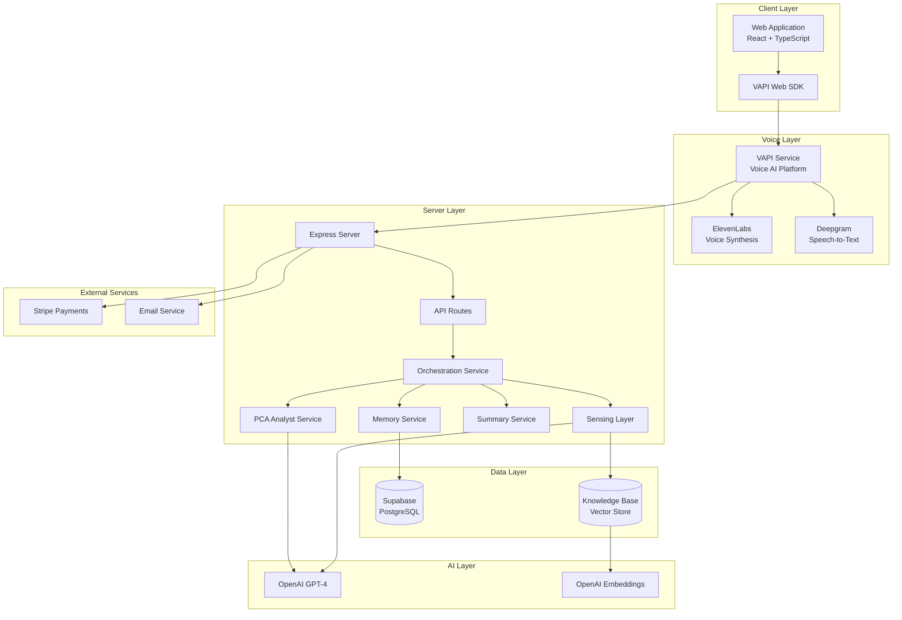
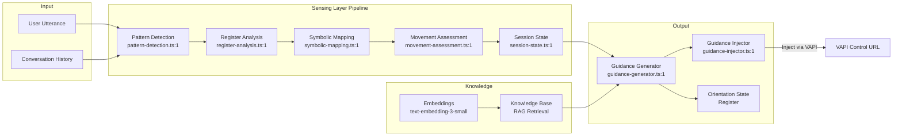
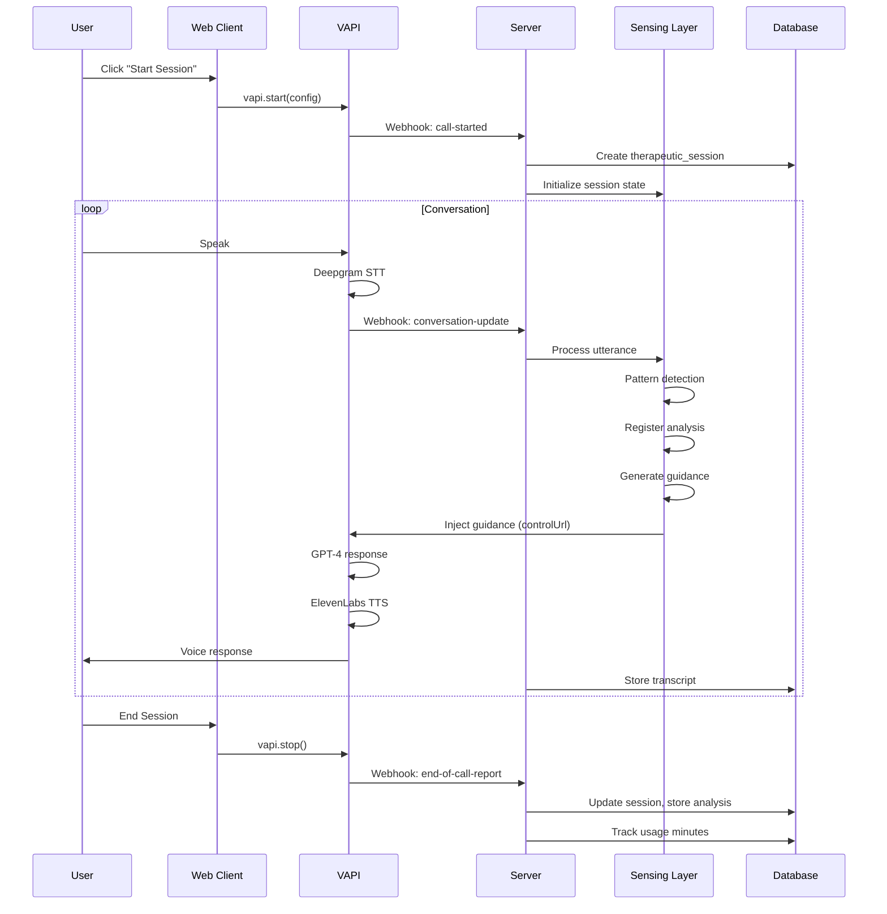
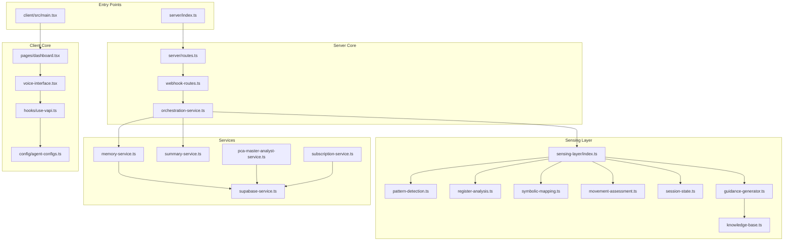
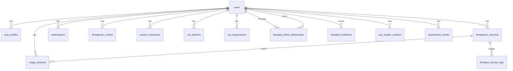

# VASA (iVASA) - Comprehensive Codebase Index

> **Voice-Activated Therapeutic AI Platform**
> An intelligent voice assistant platform for therapeutic support powered by advanced AI, VAPI voice technology, and sophisticated psychological analysis frameworks.

---

## Table of Contents

- [1. Platform Overview](#1-platform-overview)
- [2. Architecture Diagrams](#2-architecture-diagrams)
  - [2.1 High-Level System Architecture](#21-high-level-system-architecture)
  - [2.2 Sensing Layer Architecture](#22-sensing-layer-architecture)
  - [2.3 Voice Session Flow](#23-voice-session-flow)
  - [2.4 Module Dependencies](#24-module-dependencies)
- [3. Directory Structure](#3-directory-structure)
- [4. Agent Capabilities & Capacities](#4-agent-capabilities--capacities)
  - [4.1 Therapeutic Voice Agents](#41-therapeutic-voice-agents)
  - [4.2 Agent Orchestration](#42-agent-orchestration)
  - [4.3 Sensing Layer Intelligence](#43-sensing-layer-intelligence)
- [5. Server-Side Modules](#5-server-side-modules)
  - [5.1 Core Services](#51-core-services)
  - [5.2 Sensing Layer Services](#52-sensing-layer-services)
  - [5.3 API Routes](#53-api-routes)
- [6. Client-Side Modules](#6-client-side-modules)
  - [6.1 Pages](#61-pages)
  - [6.2 Components](#62-components)
  - [6.3 Hooks](#63-hooks)
- [7. Shared Modules](#7-shared-modules)
- [8. Data Models & Database Schema](#8-data-models--database-schema)
- [9. API Endpoints Reference](#9-api-endpoints-reference)
- [10. Configuration & Environment](#10-configuration--environment)
- [11. Key Integrations](#11-key-integrations)
- [12. Therapeutic Frameworks](#12-therapeutic-frameworks)

---

## 1. Platform Overview

**VASA (iVASA)** is a sophisticated therapeutic AI voice assistant platform that combines:

- **Voice AI Technology**: Real-time voice conversations using VAPI (Voice API)
- **Therapeutic Intelligence**: PsychoContextual Analysis (PCA) and Pure Contextual Perception (PCP) frameworks
- **Multi-Agent System**: Four distinct therapeutic voice personas (Sarah, Marcus, Mathew, UNA)
- **Real-Time Guidance**: Sensing Layer for live therapeutic direction during sessions
- **Multi-User Roles**: Individual users, therapists with clients, partners, influencers, and admins

### Technology Stack

| Layer | Technology |
|-------|-----------|
| **Frontend** | React 18, TypeScript, TailwindCSS, Shadcn/UI |
| **Backend** | Node.js, Express, TypeScript |
| **Database** | PostgreSQL via Supabase, Drizzle ORM |
| **Voice AI** | VAPI (Voice API) with ElevenLabs voices |
| **AI/ML** | OpenAI GPT-4, text-embedding-3-small |
| **Authentication** | Supabase Auth |
| **Payments** | Stripe (subscriptions, checkout) |
| **Build** | Vite, esbuild |

---

## 2. Architecture Diagrams

### 2.1 High-Level System Architecture



### 2.2 Sensing Layer Architecture



### 2.3 Voice Session Flow



### 2.4 Module Dependencies



---

## 3. Directory Structure

```
VASA-PLUS/
├── client/                      # Frontend React application
│   ├── src/
│   │   ├── components/          # React components
│   │   │   ├── authentication.tsx
│   │   │   ├── voice-interface.tsx
│   │   │   ├── SessionAnalysis.tsx
│   │   │   ├── ConsentPopup.tsx
│   │   │   ├── AssessmentIframe.tsx
│   │   │   ├── shared/
│   │   │   │   ├── Header.tsx
│   │   │   │   └── ...
│   │   │   └── ui/              # Shadcn UI components
│   │   ├── config/
│   │   │   └── agent-configs.ts # Therapeutic agent definitions
│   │   ├── hooks/
│   │   │   └── use-vapi.ts      # VAPI voice integration hook
│   │   ├── lib/
│   │   │   ├── supabaseClient.ts
│   │   │   ├── auth-helpers.ts
│   │   │   └── utils.ts
│   │   ├── pages/
│   │   │   ├── dashboard.tsx    # Main routing dashboard
│   │   │   ├── client-dashboard.tsx
│   │   │   ├── therapist-dashboard.tsx
│   │   │   ├── partner-dashboard.tsx
│   │   │   ├── influencer-dashboard.tsx
│   │   │   └── admin-dashboard.tsx
│   │   └── App.tsx
│   └── index.html
│
├── server/                      # Backend Express application
│   ├── index.ts                 # Server entry point
│   ├── routes.ts                # Main route registration
│   ├── routes/                  # API route modules
│   │   ├── auth-routes.ts
│   │   ├── webhook-routes.ts    # VAPI webhooks
│   │   ├── subscription-routes.ts
│   │   ├── therapist-routes.ts
│   │   ├── partner-routes.ts
│   │   ├── influencer-routes.ts
│   │   ├── admin-routes.ts
│   │   ├── chat-routes.ts
│   │   ├── analysis-routes.ts
│   │   ├── assessment-routes.ts
│   │   ├── stripe-webhook.ts
│   │   ├── stripe-checkout.ts
│   │   └── blog-routes.ts
│   ├── services/                # Business logic services
│   │   ├── orchestration-service.ts
│   │   ├── memory-service.ts
│   │   ├── summary-service.ts
│   │   ├── subscription-service.ts
│   │   ├── supabase-service.ts
│   │   ├── css-pattern-service.ts
│   │   ├── pca-master-analyst-service.ts
│   │   ├── enhanced-therapeutic-tracker.ts
│   │   └── sensing-layer/       # Real-time therapeutic AI
│   │       ├── index.ts
│   │       ├── types.ts
│   │       ├── pattern-detection.ts
│   │       ├── register-analysis.ts
│   │       ├── symbolic-mapping.ts
│   │       ├── movement-assessment.ts
│   │       ├── session-state.ts
│   │       ├── guidance-generator.ts
│   │       ├── guidance-injector.ts
│   │       ├── knowledge-base.ts
│   │       └── call-state.ts
│   └── prompts/                 # AI prompt templates
│       └── master-pc-analyst.ts
│
├── shared/                      # Shared code between client/server
│   └── schema.ts                # Drizzle ORM database schema
│
├── migrations/                  # Database migrations
├── docs/                        # Documentation
├── knowledge/                   # Knowledge base documents
├── scripts/                     # Utility scripts
│
├── package.json
├── tsconfig.json
├── vite.config.ts
├── drizzle.config.ts
└── .env.example
```

---

## 4. Agent Capabilities & Capacities

### 4.1 Therapeutic Voice Agents

The platform features four distinct therapeutic AI voice personas, each with unique therapeutic approaches and voice characteristics:

#### Sarah - The Grounded Guide
**Location**: `client/src/config/agent-configs.ts:46`

| Property | Value |
|----------|-------|
| **Therapeutic Approach** | Warm, nurturing presence with focus on emotional safety |
| **Voice Provider** | ElevenLabs |
| **Voice ID** | `cgSgspJ2msm6clMCkdW9` |
| **Model** | `eleven_flash_v2_5` |
| **Speech Characteristics** | Stability: 0.85, Similarity: 0.85, Speed: 0.95 |
| **AI Model** | GPT-4o-mini, Temperature: 0.7 |

**Core Capabilities**:
- Creates safe emotional containers
- Specializes in grounding and stabilization
- Uses metaphors of nature and calm
- Expert in early-stage therapeutic work (pointed_origin, focus_bind)

#### Marcus - The Compassionate Strategist
**Location**: `client/src/config/agent-configs.ts:156`

| Property | Value |
|----------|-------|
| **Therapeutic Approach** | Structured, strategic with cognitive clarity |
| **Voice Provider** | ElevenLabs |
| **Voice ID** | `TX3LPaxmHKxFdv7VOQHJ` |
| **Model** | `eleven_flash_v2_5` |
| **Speech Characteristics** | Stability: 0.9, Similarity: 0.85, Speed: 1.0 |
| **AI Model** | GPT-4o-mini, Temperature: 0.65 |

**Core Capabilities**:
- Pattern recognition and cognitive restructuring
- Helps identify and articulate contradictions (CVDC work)
- Strategic goal-setting and progress tracking
- Best for mid-stage therapeutic work (focus_bind, suspension)

#### Mathew - The Deep Listener
**Location**: `client/src/config/agent-configs.ts:258`

| Property | Value |
|----------|-------|
| **Therapeutic Approach** | Deep, contemplative exploration |
| **Voice Provider** | ElevenLabs |
| **Voice ID** | `CwhRBWXzGAHq8TQ4Fs17` |
| **Model** | `eleven_flash_v2_5` |
| **Speech Characteristics** | Stability: 0.9, Similarity: 0.85, Speed: 0.9 |
| **AI Model** | GPT-4o-mini, Temperature: 0.7 |

**Core Capabilities**:
- Profound active listening
- Explores symbolic meanings and metaphors
- Works with dreams, symbols, and unconscious material
- Specializes in suspension and gesture_toward stages

#### UNA - The Integration Facilitator
**Location**: `client/src/config/agent-configs.ts:368`

| Property | Value |
|----------|-------|
| **Therapeutic Approach** | Integration, synthesis, and completion |
| **Voice Provider** | ElevenLabs |
| **Voice ID** | `EXAVITQu4vr4xnSDxMaL` (Bella) |
| **Model** | `eleven_flash_v2_5` |
| **Speech Characteristics** | Stability: 0.85, Similarity: 0.9, Speed: 1.0 |
| **AI Model** | GPT-4o-mini, Temperature: 0.75 |

**Core Capabilities**:
- Synthesizes insights from prior sessions
- Facilitates integration of contradictions (CYVC work)
- Celebrates progress and consolidates gains
- Specializes in completion and terminal stages

### 4.2 Agent Orchestration

**Location**: `server/services/orchestration-service.ts:1`

The orchestration service manages the lifecycle of therapeutic sessions:

```
┌─────────────────────────────────────────────────────────────┐
│                  ORCHESTRATION SERVICE                       │
├─────────────────────────────────────────────────────────────┤
│                                                              │
│  initializeSession(userId, callId, agentName)               │
│    ├── Create therapeutic_session record                     │
│    ├── Initialize sensing layer                              │
│    └── Load memory context                                   │
│                                                              │
│  processTranscript(callId, text, role, userId, agentName)   │
│    ├── Store transcript segment                              │
│    ├── Process through sensing layer                         │
│    ├── Detect CSS patterns                                   │
│    └── Update session state                                  │
│                                                              │
│  processEndOfCall(callId, transcript, summary, callData)    │
│    ├── Finalize session                                      │
│    ├── Generate session summary                              │
│    ├── Store therapeutic context                             │
│    ├── Track CSS progressions                                │
│    └── Clean up session state                                │
│                                                              │
│  ensureSession(callId, userId, agentName)                   │
│    └── Create/retrieve session for webhook processing        │
│                                                              │
└─────────────────────────────────────────────────────────────┘
```

### 4.3 Sensing Layer Intelligence

**Location**: `server/services/sensing-layer/index.ts:1`

The Sensing Layer is the real-time therapeutic intelligence system that analyzes conversations and generates guidance for agents during live sessions.

#### Core Components

| Component | File | Purpose |
|-----------|------|---------|
| **Index/Main** | `index.ts:1` | Central orchestrator, session management |
| **Types** | `types.ts:1` | TypeScript interfaces for OSR, patterns, etc. |
| **Pattern Detection** | `pattern-detection.ts:1` | Identifies CVDC, IBM, THEND, CYVC patterns |
| **Register Analysis** | `register-analysis.ts:1` | Analyzes Real/Symbolic/Imaginary registers |
| **Symbolic Mapping** | `symbolic-mapping.ts:1` | Maps symbolic elements and connections |
| **Movement Assessment** | `movement-assessment.ts:1` | Tracks therapeutic movement trajectory |
| **Session State** | `session-state.ts:1` | Manages in-memory session accumulation |
| **Guidance Generator** | `guidance-generator.ts:1` | Creates therapeutic guidance from analysis |
| **Guidance Injector** | `guidance-injector.ts:1` | Injects guidance via VAPI control URL |
| **Knowledge Base** | `knowledge-base.ts:1` | RAG retrieval for PCA/PCP guidance |
| **Call State** | `call-state.ts:1` | Manages VAPI call URLs and history |

#### Orientation State Register (OSR)

The OSR is the central data structure that accumulates therapeutic intelligence:

```typescript
interface OrientationStateRegister {
  sessionId: string;
  callId: string;
  userId: string;
  exchangeCount: number;

  patterns: {
    activePatterns: Pattern[];
    patternHistory: Pattern[];
    dominantPattern: Pattern | null;
  };

  register: {
    currentRegister: 'real' | 'symbolic' | 'imaginary';
    registerScores: { real: number; symbolic: number; imaginary: number };
    stucknessScore: number;
    registerHistory: RegisterState[];
  };

  symbolic: {
    activeSymbols: Symbol[];
    symbolClusters: SymbolCluster[];
    generativeInsight: GenerativeInsight | null;
  };

  movement: {
    trajectory: 'toward_mastery' | 'resistance' | 'exploration' | 'deepening';
    momentum: number;
    cssStage: CSSStage;
    anticipation: AnticipationState;
  };

  significantMoments: SignificantMoment[];
  lastUpdated: Date;
}
```

---

## 5. Server-Side Modules

### 5.1 Core Services

#### Memory Service
**Location**: `server/services/memory-service.ts:1`

Manages user memory and context retrieval for session continuity:

| Function | Description |
|----------|-------------|
| `getMemoryContext(userId)` | Retrieves accumulated therapeutic context |
| `storeSessionInsight(userId, insight)` | Stores new therapeutic insights |
| `getLastSessionSummary(userId)` | Gets most recent session summary |
| `buildContextForAgent(userId)` | Constructs context for agent prompts |

#### Summary Service
**Location**: `server/services/summary-service.ts:1`

Generates intelligent session summaries:

| Function | Description |
|----------|-------------|
| `generateSessionSummary(transcript, patterns)` | Creates AI-powered summary |
| `extractKeyInsights(transcript)` | Identifies important therapeutic moments |
| `detectEmotionalArc(transcript)` | Maps emotional progression |

#### Subscription Service
**Location**: `server/services/subscription-service.ts:1`

Handles subscription management and usage tracking:

| Function | Description |
|----------|-------------|
| `getSubscription(userId)` | Retrieves user's subscription |
| `trackUsageSession(userId, minutes, sessionId)` | Records session usage |
| `checkUsageLimit(userId)` | Validates remaining minutes |
| `createSubscription(userId, tier)` | Creates new subscription |
| `cancelSubscription(userId)` | Handles cancellation |

#### CSS Pattern Service
**Location**: `server/services/css-pattern-service.ts:1`

Detects Core Symbol Set patterns in transcripts:

| Function | Description |
|----------|-------------|
| `detectCSSPatterns(transcript, detailed)` | Main pattern detection |
| `assessPatternConfidence(patterns)` | Calculates confidence scores |
| `determineCSSStage(patterns)` | Identifies current CSS stage |

#### PCA Master Analyst Service
**Location**: `server/services/pca-master-analyst-service.ts:1`

Performs comprehensive PsychoContextual Analysis:

| Function | Description |
|----------|-------------|
| `performAnalysis(userId, sessionCount)` | Main analysis entry point |
| `fetchTranscripts(userId, limit)` | Retrieves session transcripts |
| `callOpenAI(prompt)` | Executes AI analysis |
| `parseAIResponse(response)` | Extracts structured data |
| `storeComprehensiveAnalysis(data)` | Persists to database |
| `storeTherapeuticContext(userId, analysisId, parsed)` | Saves VASA context |

### 5.2 Sensing Layer Services

#### Pattern Detection
**Location**: `server/services/sensing-layer/pattern-detection.ts:1`

```
Pattern Types Detected:
├── CVDC (Constant Variably Determined Contradiction)
│   └── Binary thinking, either/or statements, contradictions
├── IBM (Internal Behavioral Matrix)
│   └── Behavioral patterns, habits, automatic responses
├── THEND (Transitional Holding)
│   └── Moments of suspension, sitting with uncertainty
└── CYVC (Constant Yet Variable Conclusion)
    └── Integration, resolution, synthesis
```

#### Register Analysis
**Location**: `server/services/sensing-layer/register-analysis.ts:1`

Analyzes psychological register dominance:

| Register | Indicators |
|----------|-----------|
| **Real** | Physical sensations, immediate feelings, body-focused language |
| **Symbolic** | Metaphors, meaning-making, narrative structure |
| **Imaginary** | Stories, identifications, emotional narratives |

#### Guidance Generator
**Location**: `server/services/sensing-layer/guidance-generator.ts:1`

Generates real-time therapeutic guidance:

| Output | Description |
|--------|-------------|
| `posture` | Suggested therapeutic stance (reflective, challenging, supportive) |
| `urgency` | How quickly to intervene (low, medium, high) |
| `focus` | What to focus on in response |
| `avoidance` | What therapeutic moves to avoid |
| `retrievedContext` | Relevant PCA/PCP knowledge from RAG |

### 5.3 API Routes

#### Main Routes Registration
**Location**: `server/routes.ts:1`

| Route Path | Handler | Description |
|------------|---------|-------------|
| `/api/auth/*` | `auth-routes.ts` | Authentication endpoints |
| `/api/vapi/*` | `webhook-routes.ts` | VAPI webhook handlers |
| `/api/subscription/*` | `subscription-routes.ts` | Subscription management |
| `/api/therapist/*` | `therapist-routes.ts` | Therapist portal |
| `/api/partner/*` | `partner-routes.ts` | Partner portal |
| `/api/influencer/*` | `influencer-routes.ts` | Influencer portal |
| `/api/admin/*` | `admin-routes.ts` | Admin portal |
| `/api/chat/*` | `chat-routes.ts` | Text chat endpoints |
| `/api/analysis/*` | `analysis-routes.ts` | Session analysis |
| `/api/assessment/*` | `assessment-routes.ts` | User assessments |
| `/api/stripe/*` | `stripe-checkout.ts` | Stripe checkout |
| `/api/stripe-webhook/*` | `stripe-webhook.ts` | Stripe webhooks |
| `/api/blog/*` | `blog-routes.ts` | Blog management |
| `/api/health` | `routes.ts:52` | Health check |
| `/api/health/db-check` | `routes.ts:74` | Database health |

#### Webhook Routes (VAPI Integration)
**Location**: `server/routes/webhook-routes.ts:1`

| Endpoint | Event Type | Actions |
|----------|-----------|---------|
| `POST /api/vapi/webhook` | `call-started` | Initialize session, store control URL |
| `POST /api/vapi/webhook` | `conversation-update` | Process transcripts, run sensing layer |
| `POST /api/vapi/webhook` | `end-of-call-report` | Finalize session, generate summaries |

---

## 6. Client-Side Modules

### 6.1 Pages

| Page | Location | Purpose |
|------|----------|---------|
| **Dashboard** | `client/src/pages/dashboard.tsx:1` | Main routing hub, auth handling |
| **Client Dashboard** | `client/src/pages/client-dashboard.tsx` | Individual user dashboard |
| **Therapist Dashboard** | `client/src/pages/therapist-dashboard.tsx` | Therapist portal with client management |
| **Partner Dashboard** | `client/src/pages/partner-dashboard.tsx` | Partner organization portal |
| **Influencer Dashboard** | `client/src/pages/influencer-dashboard.tsx` | Influencer tracking portal |
| **Admin Dashboard** | `client/src/pages/admin-dashboard.tsx` | System administration |

### 6.2 Components

#### Core Components

| Component | Location | Purpose |
|-----------|----------|---------|
| **Authentication** | `authentication.tsx` | Login/signup flow |
| **VoiceInterface** | `voice-interface.tsx` | Main voice session UI |
| **SessionAnalysis** | `SessionAnalysis.tsx` | Post-session analysis display |
| **ConsentPopup** | `ConsentPopup.tsx` | Terms acceptance |
| **AssessmentIframe** | `AssessmentIframe.tsx` | Embedded assessment form |
| **AssessmentModal** | `AssessmentModal.tsx` | Assessment wrapper |
| **Header** | `shared/Header.tsx` | Navigation header |

### 6.3 Hooks

#### useVapi Hook
**Location**: `client/src/hooks/use-vapi.ts:1`

The primary hook for VAPI voice integration:

```typescript
interface UseVapiProps {
  userId: string;
  memoryContext: string;
  lastSessionSummary?: string | null;
  shouldReferenceLastSession?: boolean;
  firstName: string;
  selectedAgent: TherapeuticAgent;
  sessionDurationLimit?: number;
  onboarding?: OnboardingData | null;
}

interface UseVapiReturn {
  isSessionActive: boolean;
  isLoading: boolean;
  startSession: () => void;
  endSession: () => void;
  connectionStatus: 'connecting' | 'connected' | 'disconnected';
  onTranscript: (callback: (message: TranscriptMessage) => void) => void;
  onSpeechUpdate: (callback: (message: SpeechUpdateMessage) => void) => void;
  error: string | null;
  clearError: () => void;
}
```

**Key Features**:
- Dynamic system prompt construction with memory context
- Therapeutic speech configuration (extended wait times, smart endpointing)
- Session continuity with last session reference
- Onboarding context injection
- Webhook URL configuration

---

## 7. Shared Modules

### Schema (Drizzle ORM)
**Location**: `shared/schema.ts:1`

Defines the complete database schema using Drizzle ORM with Supabase/PostgreSQL.

---

## 8. Data Models & Database Schema

### Core Tables



### Table Reference

| Table | Location | Purpose |
|-------|----------|---------|
| `users` | `schema.ts:8` | Primary user identity |
| `user_profiles` | `schema.ts:24` | Extended user profiles |
| `user_onboarding_responses` | `schema.ts:53` | Onboarding data |
| `assessment_results` | `schema.ts:64` | Assessment responses |
| `subscriptions` | `schema.ts:94` | Subscription data |
| `usage_sessions` | `schema.ts:114` | Usage tracking |
| `therapeutic_sessions` | `schema.ts:178` | Voice session records |
| `therapeutic_context` | `schema.ts:194` | Accumulated insights |
| `session_transcripts` | `schema.ts:209` | Transcript storage |
| `css_patterns` | `schema.ts:237` | Detected patterns |
| `css_progressions` | `schema.ts:219` | Stage transitions |
| `therapeutic_movements` | `schema.ts:257` | Movement tracking |
| `therapist_client_relationships` | `schema.ts:140` | Therapist-client links |
| `therapist_invitations` | `schema.ts:151` | Client invitations |
| `therapist_access_logs` | `schema.ts:166` | Access audit trail |
| `pca_master_analysis` | `schema.ts:861` | Comprehensive analyses |
| `partner_organizations` | `schema.ts:268` | Partner orgs |
| `influencer_profiles` | `schema.ts:548` | Influencer data |
| `blog_posts` | `schema.ts:788` | Blog content |
| `user_email_preferences` | `schema.ts:909` | Email settings |

### Key Enumerations

```typescript
// CSS Stages (Conscious Stage System)
const CSS_STAGES = {
  POINTED_ORIGIN: 'pointed_origin',   // Initial recognition
  FOCUS_BIND: 'focus_bind',           // Concentrated engagement
  SUSPENSION: 'suspension',            // Holding without collapse
  GESTURE_TOWARD: 'gesture_toward',   // Movement toward integration
  COMPLETION: 'completion',            // Achievement of integration
  TERMINAL: 'terminal'                 // Meta-awareness
};

// Pattern Types
const PATTERN_TYPES = {
  CVDC: 'CVDC',                        // Contradiction patterns
  IBM: 'IBM',                          // Behavioral patterns
  THEND: 'THEND',                      // Transitional holding
  CYVC: 'CYVC',                        // Integration patterns
  STAGE_ASSESSMENT: 'STAGE_ASSESSMENT',
  MOVEMENT: 'MOVEMENT',
  PROCESS: 'PROCESS'
};

// Movement Types
const MOVEMENT_TYPES = {
  DEEPENING: 'deepening',
  RESISTANCE: 'resistance',
  INTEGRATION: 'integration',
  EXPLORATION: 'exploration'
};
```

---

## 9. API Endpoints Reference

### Authentication (`/api/auth/*`)

| Method | Endpoint | Description |
|--------|----------|-------------|
| POST | `/api/auth/user` | Create/get user profile |
| GET | `/api/auth/session` | Get current session |
| POST | `/api/auth/logout` | Sign out user |

### VAPI Webhooks (`/api/vapi/*`)

| Method | Endpoint | Description |
|--------|----------|-------------|
| POST | `/api/vapi/webhook` | Main VAPI webhook handler |
| POST | `/api/vapi/test-css-patterns` | Test CSS pattern detection |
| POST | `/api/vapi/recover-orphaned-sessions` | Recover orphaned sessions |

### Subscriptions (`/api/subscription/*`)

| Method | Endpoint | Description |
|--------|----------|-------------|
| GET | `/api/subscription/status` | Get subscription status |
| POST | `/api/subscription/create` | Create subscription |
| POST | `/api/subscription/cancel` | Cancel subscription |

### Therapist Portal (`/api/therapist/*`)

| Method | Endpoint | Description |
|--------|----------|-------------|
| GET | `/api/therapist/clients` | List therapist's clients |
| POST | `/api/therapist/invite` | Send client invitation |
| POST | `/api/therapist/accept-invitation` | Accept invitation |
| GET | `/api/therapist/client/:id/sessions` | Get client sessions |
| GET | `/api/therapist/client/:id/analysis` | Get client analysis |

### Analysis (`/api/analysis/*`)

| Method | Endpoint | Description |
|--------|----------|-------------|
| GET | `/api/analysis/session/:callId` | Get session analysis |
| POST | `/api/analysis/generate` | Generate new analysis |
| GET | `/api/analysis/pca/:userId` | Get PCA master analysis |

### Assessment (`/api/assessment/*`)

| Method | Endpoint | Description |
|--------|----------|-------------|
| POST | `/api/assessment/save` | Save assessment results |
| POST | `/api/assessment/link` | Link assessment to user |
| GET | `/api/assessment/:userId` | Get user's assessment |

### Health Checks

| Method | Endpoint | Description |
|--------|----------|-------------|
| GET | `/api/health` | Basic health check |
| GET | `/api/health/db-check` | Database connectivity |

---

## 10. Configuration & Environment

### Environment Variables

**Location**: `.env.example`

```bash
# Database
DATABASE_URL=postgresql://...
SUPABASE_URL=https://xxx.supabase.co
SUPABASE_ANON_KEY=<SUPABASE_ANON_KEY>
SUPABASE_SERVICE_ROLE_KEY=<SUPABASE_SERVICE_ROLE_KEY>

# VAPI (Voice AI)
VAPI_PUBLIC_KEY=pk_...
VAPI_SECRET_KEY=sk_...
VAPI_SERVER_SECRET=...

# OpenAI
OPENAI_API_KEY=<OPENAI_API_KEY>

# ElevenLabs (via VAPI)
ELEVENLABS_API_KEY=...

# Stripe
STRIPE_SECRET_KEY=sk_...
STRIPE_WEBHOOK_SECRET=<STRIPE_WEBHOOK_SECRET>
STRIPE_PRICE_ID_PLUS=price_...
STRIPE_PRICE_ID_PRO=price_...

# Email
RESEND_API_KEY=re_...

# Application
VITE_SERVER_URL=https://...
NODE_ENV=production
```

### Build Configuration

| File | Purpose |
|------|---------|
| `vite.config.ts` | Frontend build configuration |
| `tsconfig.json` | TypeScript configuration |
| `drizzle.config.ts` | Database migration config |
| `tailwind.config.js` | TailwindCSS configuration |

---

## 11. Key Integrations

### VAPI (Voice AI Platform)

**Integration Points**:
- `client/src/hooks/use-vapi.ts` - Client SDK integration
- `server/routes/webhook-routes.ts` - Server webhook handlers
- `server/services/sensing-layer/call-state.ts` - Call control management
- `server/services/sensing-layer/guidance-injector.ts` - Real-time guidance injection

**VAPI Configuration** (`use-vapi.ts:339`):
```typescript
{
  model: { provider: 'openai', model: 'gpt-4o-mini' },
  voice: { provider: 'elevenlabs', voiceId: '...' },
  transcriber: { provider: 'deepgram', model: 'nova-2' },
  startSpeakingPlan: { waitSeconds: 1.2, smartEndpointingEnabled: true },
  stopSpeakingPlan: { numWords: 3, voiceSeconds: 0.5 },
  serverUrl: '/api/vapi/webhook',
  maxDurationSeconds: sessionDurationLimit
}
```

### Supabase

**Integration Points**:
- `server/services/supabase-service.ts` - Server client
- `client/src/lib/supabaseClient.ts` - Client SDK
- `shared/schema.ts` - Database schema definitions

**Features Used**:
- PostgreSQL database
- Row Level Security (RLS)
- Authentication (email, magic links)
- Real-time subscriptions
- Vector embeddings (pgvector)

### Stripe

**Integration Points**:
- `server/routes/stripe-checkout.ts` - Checkout sessions
- `server/routes/stripe-webhook.ts` - Event handling
- `server/services/subscription-service.ts` - Subscription logic

**Events Handled**:
- `checkout.session.completed`
- `customer.subscription.updated`
- `customer.subscription.deleted`
- `invoice.payment_succeeded`
- `invoice.payment_failed`

### OpenAI

**Integration Points**:
- `server/services/pca-master-analyst-service.ts` - GPT-4 analysis
- `server/services/sensing-layer/knowledge-base.ts` - Embeddings
- `server/services/summary-service.ts` - Session summaries

**Models Used**:
- `gpt-4o-mini` - Voice agent conversations
- `gpt-3.5-turbo-16k` - PCA analysis
- `text-embedding-3-small` - Vector embeddings

---

## 12. Therapeutic Frameworks

### Pure Contextual Perception (PCP)

**Location**: `server/prompts/master-pc-analyst.ts:1`

PCP is the foundational perceptual framework based on:

```
Perception = Interactiveness between Real and Imaginary, mediated by Symbolic

┌─────────────────────────────────────────────────────────┐
│                    TRIADIC STRUCTURE                     │
├─────────────┬─────────────────────────────────┬─────────┤
│    REAL     │         SYMBOLIC                │IMAGINARY│
├─────────────┼─────────────────────────────────┼─────────┤
│ Immediate   │ Language, meaning,              │ Images, │
│ bodily      │ narrative, structure            │ stories,│
│ experience  │ (The Word)                      │emotions │
├─────────────┼─────────────────────────────────┼─────────┤
│ Feelings    │ Mediation between               │Emotions │
│ (sensations)│ Real and Imaginary              │(stories)│
└─────────────┴─────────────────────────────────┴─────────┘
```

**Diagnostic Framework**:
- **Psychotic structure**: Symbolic impedes Real and Imaginary
- **Obsessive-neurotic**: Imaginary imposes over Symbolic and Real
- **Hysteric-neurotic**: Real dominates over Imaginary and Symbolic

### PsychoContextual Analysis (PCA)

The therapeutic praxis that operationalizes PCP:

#### CVDC (Constant Variably Determined Contradiction)
The capacity to hold contradictory concepts simultaneously:
- Identifies binary thinking traps
- Finds "binding quality" uniting opposites
- Recognizes recursive problem-creation patterns

#### THEND (Transitional Holding)
The liminal space between CVDC and CYVC:
- Suspension of contradiction
- Dynamic equilibrium without rush to resolution
- "Sitting with" uncertainty

#### CYVC (Constant Yet Variable Conclusion)
Achievement of stable yet adaptable integration:
- Conscious determination over symbolic functioning
- Flexible adaptation to changing contexts
- No longer unconsciously determined by trauma

### Core Symbol Set (CSS) Stages

```
Stage 1: Pointed Origin (⌄)
├── Initial recognition of fragmentation
├── Presenting issue identified
└── Entry point for therapeutic work

Stage 2: Focus/Bind (•)
├── Concentrated engagement with contradiction
├── Binding quality identified
└── Holding opposites in awareness

Stage 3: Suspension (_)
├── State of Thend
├── Holding without collapsing
└── Metabolizing contradiction

Stage 4: Gesture Toward (1)
├── Movement toward integration
├── First steps of symbolic coherence
└── Emerging resolution

Stage 5: Completion (2)
├── Achievement of integration
├── Stable symbolic functioning
└── Contradiction transformed

Stage 6: Terminal Symbol (Ø)
├── Meta-awareness achieved
├── Capacity for recursive reflection
└── Unknown variable made conscious
```

---

## Document Information

| Property | Value |
|----------|-------|
| **Generated** | 2024 |
| **Repository** | VASA-PLUS |
| **Branch** | `claude/codebase-documentation-index-ba6wF` |
| **Purpose** | Comprehensive codebase documentation |
| **Audience** | Developers, maintainers, architects |

---

*This document was generated through comprehensive codebase analysis and is intended to serve as a living reference for all stakeholders working with the VASA platform.*
