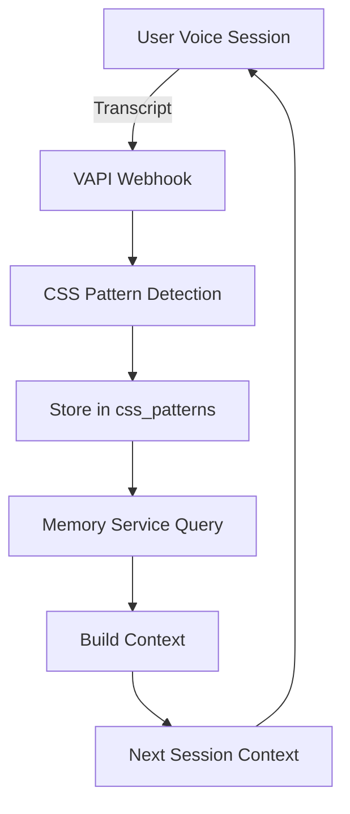

# CSS (Conversational State Sensing) Tracking Architecture

## Overview
CSS tracking detects psychological patterns in therapeutic conversations, categorizing users into six developmental stages based on their behavioral contradictions and linguistic patterns.

## The Six CSS Stages

### 1. **Pointed Origin** (Initial Stage)
- **Pattern:** Confusion between desires and actions
- **Indicators:** "I want X BUT I do Y" contradictions
- **Example:** "I want to be productive BUT I keep scrolling"

### 2. **Imaginary Capture**
- **Pattern:** Living in fantasies, avoiding reality
- **Indicators:** Excessive planning without execution
- **Example:** "I imagine success BUT never start"

### 3. **Symbolic Struggle**
- **Pattern:** Overthinking and analysis paralysis
- **Indicators:** Understanding without action
- **Example:** "I know what to do BUT can't begin"

### 4. **Mirror Crisis**
- **Pattern:** Identity confusion and comparison
- **Indicators:** Self-doubt and imposter syndrome
- **Example:** "Others succeed BUT I always fail"

### 5. **Real Confrontation**
- **Pattern:** Facing actual limitations
- **Indicators:** Reality-based challenges
- **Example:** "I tried X BUT reality showed Y"

### 6. **Terminal** (Resolution Stage)
- **Pattern:** Integration and acceptance
- **Indicators:** Balanced action and reflection
- **Example:** Action without excessive contradiction

## Pattern Detection System

### Contradiction Detection (CVDC)
```javascript
// Pattern structure: "X BUT Y"
const contradictionPattern = /\b(want|need|try|should|could|would|must|have to|supposed to|meant to|planning to|going to)\b[^.!?]*\b(but|however|yet|though|although|except|still)\b[^.!?]*/gi;
```

### Imaginary-Based Messaging (IBM)
```javascript
// Fantasy and avoidance patterns
const imaginaryPatterns = [
  /\b(imagine|dream|wish|hope|fantasy|visualize|picture)\b/gi,
  /\b(if only|what if|maybe|perhaps|possibly|potentially)\b/gi,
  /\b(perfect|ideal|amazing|incredible|ultimate)\b/gi
];
```

## Database Structure

### `css_patterns` Table
```sql
CREATE TABLE css_patterns (
  id VARCHAR PRIMARY KEY,
  user_id VARCHAR REFERENCES users(id),
  call_id VARCHAR,
  detected_stage VARCHAR,
  pattern_indicators JSONB,
  cvdc_patterns TEXT[],
  ibm_patterns TEXT[],
  extracted_contradiction TEXT,
  behavioral_gap TEXT,
  confidence_score NUMERIC,
  created_at TIMESTAMP DEFAULT NOW()
);
```

### Key Fields
- **extracted_contradiction:** Preserves exact user wording (e.g., "want to be productive BUT keep scrolling")
- **behavioral_gap:** Analyzes the disconnect between intention and action
- **confidence_score:** 0.0-1.0 based on pattern clarity and frequency

## Integration Flow

### 1. **Webhook Reception**
```javascript
// server/routes/webhook-routes.ts
POST /api/vapi/webhook
├── Receives transcript from VAPI
├── Detects CSS patterns
└── Stores in css_patterns table
```

### 2. **Pattern Analysis**
```javascript
// server/services/css-pattern-service.ts
detectCSSPatterns(transcript) {
  // Extract CVDC contradictions
  // Identify IBM patterns
  // Calculate stage and confidence
  // Return structured analysis
}
```

### 3. **Memory Service Integration**
```javascript
// server/services/memory-service.ts
buildTherapeuticContext(userId) {
  // Query css_patterns for user
  // Aggregate stage progression
  // Include in agent context
}
```

### 4. **Agent Context Injection**
```javascript
// Memory context sent to VAPI agent
{
  currentStage: "pointed_origin",
  recentPatterns: [
    "want to be productive BUT keep scrolling",
    "know I should exercise BUT stay in bed"
  ],
  therapeuticProgress: "User shows persistent gap between intention and action"
}
```

## Data Flow Sequence



## Pattern Storage Examples

### Supabase Record
```json
{
  "id": "uuid",
  "user_id": "user-123",
  "call_id": "call-456",
  "detected_stage": "pointed_origin",
  "cvdc_patterns": [
    "I want to be creative BUT I'm stuck scrolling",
    "I should start projects BUT I doubt myself"
  ],
  "extracted_contradiction": "want to be creative BUT stuck scrolling",
  "behavioral_gap": "Creative aspiration blocked by avoidance behavior",
  "confidence_score": 0.85,
  "created_at": "2025-09-08T12:00:00Z"
}
```

## Therapeutic Context Building

### Query Pattern History
```sql
SELECT 
  detected_stage,
  cvdc_patterns,
  extracted_contradiction,
  confidence_score
FROM css_patterns
WHERE user_id = $1
ORDER BY created_at DESC
LIMIT 10;
```

### Aggregate Stage Progression
```javascript
const stageProgression = patterns.map(p => ({
  stage: p.detected_stage,
  confidence: p.confidence_score,
  timestamp: p.created_at
}));
```

### Context Generation
```javascript
const context = {
  dominantStage: getMostFrequentStage(patterns),
  recentContradictions: getTopContradictions(patterns, 3),
  therapeuticInsight: generateInsight(patterns),
  stageTransitions: detectStageChanges(patterns)
};
```

## Memory Persistence

### Therapeutic Context Table
```sql
CREATE TABLE therapeutic_context (
  id VARCHAR PRIMARY KEY,
  user_id VARCHAR,
  call_id VARCHAR,
  context_type VARCHAR,
  content TEXT,
  metadata JSONB,
  created_at TIMESTAMP
);
```

### Context Types
- **call_summary:** Overall session summary
- **css_analysis:** CSS pattern detection results
- **therapeutic_insight:** Key behavioral observations
- **stage_transition:** Movement between CSS stages

## Benefits

1. **Pattern Recognition:** Identifies recurring behavioral contradictions
2. **Stage Tracking:** Monitors therapeutic progress through CSS stages
3. **Personalized Interventions:** Tailors responses to user's current stage
4. **Memory Continuity:** Maintains context across sessions
5. **Therapeutic Insights:** Provides data-driven understanding of user patterns

## Usage in Sessions

### Agent Receives Context
```javascript
"You have had 3 sessions with Jordan.
Current CSS Stage: pointed_origin
Recent pattern: 'want to be productive BUT keep scrolling'
Therapeutic focus: Address gap between intention and action"
```

### Agent Response Adaptation
- **Pointed Origin:** Focus on awareness of contradictions
- **Imaginary Capture:** Ground in concrete reality
- **Symbolic Struggle:** Encourage action over analysis
- **Mirror Crisis:** Build authentic self-perception
- **Real Confrontation:** Support through challenges
- **Terminal:** Reinforce integration

## Technical Implementation

### Pattern Detection Service
- Location: `server/services/css-pattern-service.ts`
- Functions: `detectCSSPatterns()`, `assessPatternConfidence()`

### Database Operations
- Insert patterns: Via webhook routes
- Query patterns: Via memory service
- Aggregate insights: During context building

### Memory Integration
- Build context: Before each session
- Include CSS insights: In agent system prompt
- Track progression: Across multiple sessions

## Confidence Scoring

### Factors
- **Pattern Clarity:** How clearly contradictions are expressed
- **Pattern Frequency:** Number of detected patterns
- **Stage Alignment:** Consistency with stage indicators

### Calculation
```javascript
confidence = (clarityScore * 0.4) + 
             (frequencyScore * 0.3) + 
             (alignmentScore * 0.3);
```

## Future Enhancements

1. **Advanced Pattern Recognition:** ML-based pattern detection
2. **Stage Prediction:** Anticipate stage transitions
3. **Intervention Timing:** Optimal moments for specific interventions
4. **Multi-Modal Analysis:** Include voice tone and pace
5. **Progress Visualization:** User-facing progress tracking